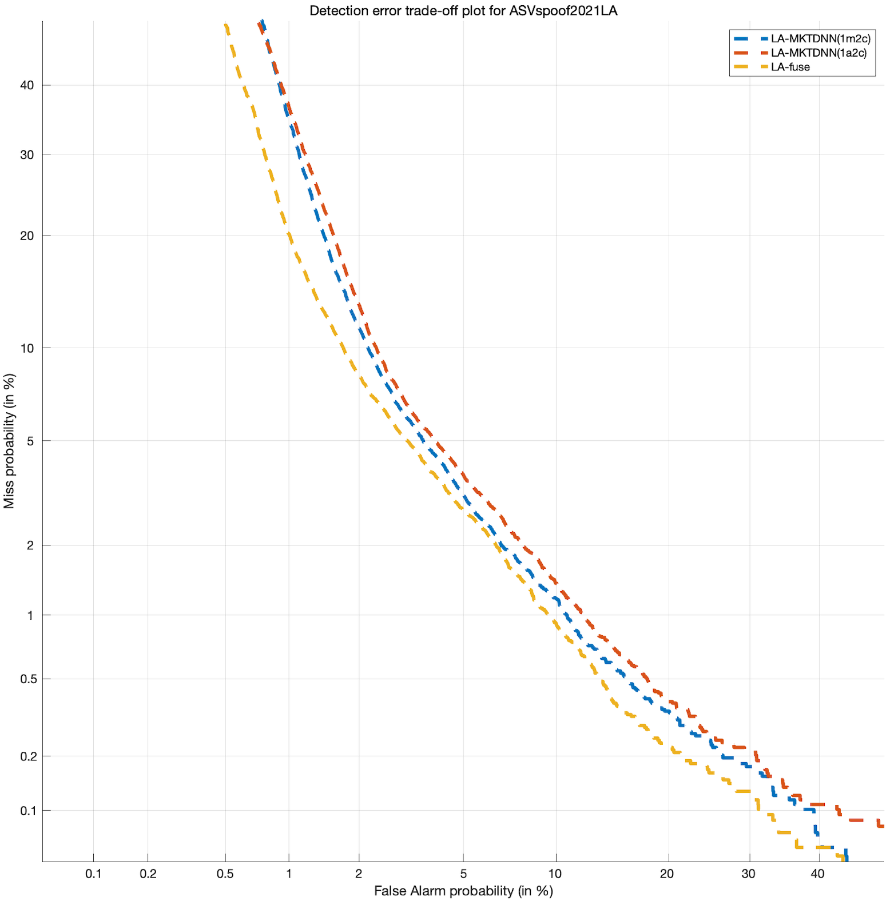

# ASVspoof Counter Measure

This project is baesd on [speechbrain](https://speechbrain.github.io).It can help you solve ASVspoof 2021 LA and DF task.

## Dataset
This project is for ASVspoof2021 LA and DF task.This project is for (LA) partition of the ASVspoof 2021[here](https://www.asvspoof.org/https://datashare.is.ed.ac.uk/handle/10283/3336). Training data is ASVspoof 2019 [here](https://datashare.is.ed.ac.uk/handle/10283/3336).Preprare dataset put the ASVSpoof2021 LA and DF dataset in ASVSpoof2019/LA folder as:

        ├── LA
        │   ├── ASVspoof2019_LA_asv_protocols
        │   ├── ASVspoof2019_LA_asv_scores
        │   ├── ASVspoof2019_LA_cm_protocols
        │   ├── ASVspoof2019_LA_dev
        │   ├── ASVspoof2019_LA_eval
        │   ├── ASVspoof2019_LA_train
        │   ├── ASVspoof2021_DF_eval
        │   ├── ASVspoof2021_LA_eval
        │   ├── LADF_AUG
        │   └── README.LA.txt
        ├── LICENSE_text.txt

## Augment
The LA and DF need data augmentation, it's a hard work. you can refer this [repo](https://github.com/yzyouzhang/ASVspoof2021_AIR). It provides the way of augment and some tips to train a more robust network. The [toolkit](https://github.com/idiap/acoustic-simulator) can help you.You can put the augment data in ASVspoof2019/LA/LADF_AUG folder as:

        LADF_aug    
        ├── codec
        │   ├── amr[br=10k2]
        |   ...
        └── compression
            ├── aac[16k]
            ...

You can use the data augmentation way in the project shown in the yaml file. It is not very efficent. Or you can design a new method.

Recently, the new augmentation way provided by this [article](https://arxiv.org/pdf/2211.06546.pdf) is easier and more efficient, but as the device and development environment, or may be wrong implementation, i can't reproduce the results in this article.

Results of different models are as follows:

| Model | Params | Augment | Acoustic features | 2021LA | 2021DF |
|:------|:------:|:--:|:-------:|:------------:|:------------:|
| ECAPA_TDNN_GLOB_c512-ContextASP-emb256（half decay StepScheduler）-P2SGradloss  | 6.31M | transmission | LFCC | EER 4.70% min-tDCF 0.2882 | - |
|                                   |       | compression | LFCC | - | EER 22.17% |
| ResNet18-ASP-emb128(Warm-up + ReduceLROnPlateau)-P2SGradloss | 1.20M | MUSAN+RIR | FBANK(Blackman-window)p | EER 3.46% min-tDCF 0.2654 | EER 16.75% |

## Prepare
### Link
Return to project main folder，make link to the ASVspoof2019 dataset folder: 
```
$ ln -s ASVspoof2019 /home/path/to/ASVspoof2019
```

### Download keyfile
The eval protocol file sizes is large. You can use bash download it.
```
$ ./download_keys.sh
```
If the network is not very well, you can download on the [website](https://www.asvspoof.org/index2021.html).Put it in keys folder like follows, the ASVspoof2019_LA_eval_asv_scores.txt file is provide in "ASVspoof2019/LA/ASVspoof2019_LA_asv_scores".

        keys
        ├── 2019LA
        │   └── ASV
        │       └── ASVspoof2019_LA_eval_asv_scores.txt
        ├── DF
        │   └── CM
        │       └── trial_metadata.txt
        └── LA
        ├── ASV
        │   ├── ASVTorch_Kaldi
        │   └── trial_metadata.txt
        └── CM
                └── trial_metadata.txt


### Requirements
```
$ pip install -r requirements
```
### Make speechbrain format.
When use the speechbrain，you should prepare the speechbrain format csv or json file.
```
$ python preprocess/prepare_2019.py && python preprocess/prepare_2021.py
```

## Training
If you not prepare all work above, To train the model in ASVspoof2019 LA run:
```
python train.py yaml/ecapa_2019.yaml
```
if all work above has down. You can train in ASVspoof2021.
```
python train.py yaml/ecapa_2021_LA.yaml
```
Or you can train in DF, the progress set will used as devset in LA and DF training. In ASVspoof2019, we test evalset in each epoch.

If you want use other models, you just need to change the yaml file.

## Test
Test the ASVspoof2019LA, just
```
python eval.py yaml/ecapa_2019_LA.yaml
```
Test the ASVspoof2021LA or DF, just
```
python eval.py yaml/ecapa_2021_LA.yaml && python eval.py yaml/ecapa_2021_DF.yaml
```
The test algorithm provide by organizers can not show the detailed EER or min-tDCF, if you want to get the detailed EER. You need to detailed in the website. [LA](https://competitions.codalab.org/competitions/35161) and [DF](https://competitions.codalab.org/competitions/35159). In eval.py, it provides visualize option. Like this:
<div  align="center"> </div>

## Plot
The matlab_plot folder provide the algorithms for plot bar or DET curves. You just to change it for use.The important thing is that the scorefile format for plot and for submit to the website is not same. Figure like this
|  | |
| ---- | ---- |

## Score fusion
This fusion algorithm is provided by this [repo](https://github.com/yzyouzhang/ASVspoof2021_AIR). But the algorithm will change the index. If you submit the score file to website, you can't get the correct detailed EER.
